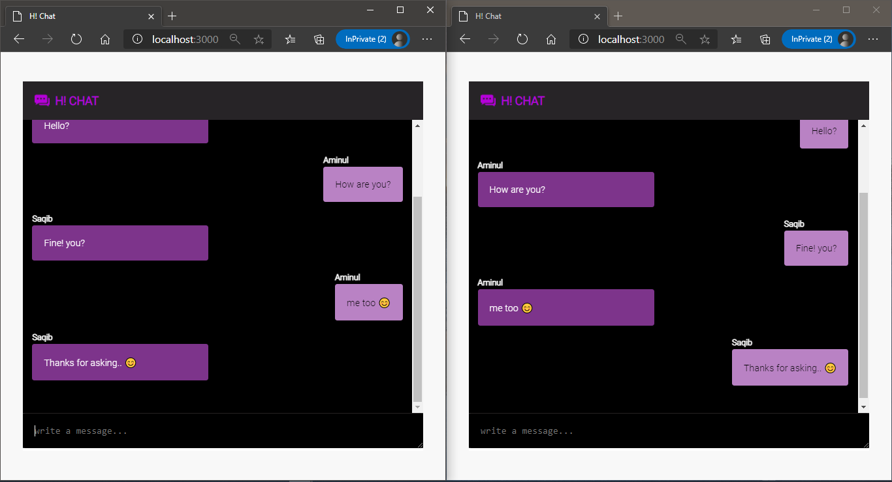

# H!-chat App

A realtime chat app in Node JS with socket.io

**Live Demo:** 

__Short description__: A realtime chat app using socket.io library which anyone can start chat going the same uri. But before start there need to provide a name of the user. Then the user can start to chat. If someone chat other people connected to the same socket will be able to see the others messages.

Used tools to this project:

*frontend*: HTML5, CSS, Javascript

*backend*: Node JS

*libraries*: `express`, socket.io

****
*Snapshot:*

